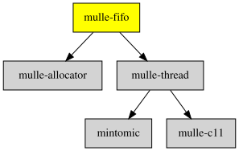

# mulle-fifo

#### 🐍 mulle-fifo fixed sized producer/consumer FIFOs holding `void *`

Written for dual-thread configurations. There is a collection of hardcoded size
FIFOs and there is a FIFO which size can be set at runtime.

You can not store NULL pointers into the FIFOs.

There are FIFOs of sizes 4, 8, 16, 32, 64, 128, 256, 512, 1024, 2048, 4096,
8192. You can easily create your own custom size.

## Contract

* Exactly **one producer thread** may call the write functions and exactly
  **one consumer thread** may call the read functions. Calls from additional
  threads are forbidden (they corrupt the state, this is not detected).
* `init` must complete before producer and consumer start, `done` must only
  be called after both have stopped. Reuse requires a fresh `init`.
* The FIFOs are **bounded and non-blocking**: writes fail instead of blocking
  or growing, reads return NULL instead of blocking. A full FIFO is the
  caller's problem: retry, back off, or drop.
* The FIFO does **not take ownership** of the pointers stored in it. It never
  frees or otherwise touches the pointed-to objects.
* `write` returns `0` on success, `-1` if the FIFO is full and `-2` if the
  pointer is NULL.
* `get_count` is a single atomic read of the shared counter: exact at the
  moment of the read, possibly stale immediately after. It may be called from
  any thread.
* All internal synchronization uses **relaxed atomic operations**. There is no
  acquire/release publication of pointee contents: if the consumer dereferences
  a dequeued pointer, use `_read_barrier` (fixed FIFOs) and, on weakly ordered
  architectures, add your own producer-side synchronization. Payload that fits
  in the pointer itself (e.g. an integer cast to `void *`) needs no barrier.
* The dynamic FIFO supports any capacity >= 2. Allocation failure follows the
  mulle-allocator contract: the allocator's `fail` function is called, which by
  default aborts the program. `done` of the dynamic FIFO is idempotent; `done`
  of a fixed FIFO is a no-op.
* Functions prefixed with an underscore do not check their fifo argument for
  NULL. The dynamic FIFO additionally offers same-named NULL-tolerant wrappers
  without the underscore.


| Release Version                                       | Release Notes  | AI Documentation
|-------------------------------------------------------|----------------|---------------
|  [](//github.com/mulle-concurrent/mulle-fifo/actions) | [RELEASENOTES](RELEASENOTES.md) | [DeepWiki for mulle-fifo](https://deepwiki.com/mulle-concurrent/mulle-fifo)


## Documentation & Guides

* [API Summary](asset/dox/api/toc)

## Usage

### Fixed

`mulle__pointerfifo64` is a fixed size 64 pointer FIFO.
Use `mulle__pointerfifo128` for a 128 pointer FIFO etc.

``` c
void   _mulle__pointerfifo64_init( struct mulle__pointerfifo64 *p)
```

Call this to initalize the FIFO for use.


``` c
void   _mulle__pointerfifo64_done( struct mulle__pointerfifo64 *p)
```

You can call this when no other thread needs the FIFO anymore.


``` c
unsigned int   _mulle__pointerfifo64_get_count( struct mulle__pointerfifo64 *p)
```

Get the number of pointers stored. This is a single atomic read of the shared
counter, safe to call from any thread.


``` c
void   *_mulle__pointerfifo64_read( struct mulle__pointerfifo64 *p)
```

Read from the FIFO. Will return NULL if empty. Will not block.
Only one thread may access the read side.

``` c
int   _mulle__pointerfifo64_write( struct mulle__pointerfifo64 *p,
                                   void *pointer)
```

Write to the FIFO. Will return 0 on success, -1 if the FIFO is full and -2 if
`pointer` is NULL. Will not block.
Only one thread may access the write side.


### Dynamic

The dynamic FIFO is like the static FIFO, except for the `init` and
`done` functions:

```
void   mulle_pointerfifo_init( struct mulle_pointerfifo *p,
                               unsigned int size,
                               struct mulle_allocator *allocator)
```

Call `mulle_pointerfifo_init` to initalize the FIFO for use.
The size is set with the `size` parameter.

Call `mulle_pointerfifo_done` to free the FIFO when no other thread needs it.
This is necessary to avoid leaks. Use `mulle_pointerfifo_read` and
`mulle_pointerfifo_write` for access. The pointerfifo will not block.


### You are here




## Add

mulle-fifo is a component of the [mulle-core](//github.com/mulle-core/mulle-core) library. So in your code include the mulle-core umbrella header:

``` c
#include <mulle-core/mulle-core.h>
```

### Add mulle-core to a cmake and git project

``` bash
git submodule add https://github.com/mulle-core/mulle-core.git mulle-core
```

Add this to your `CMakeLists.txt`:

``` cmake
add_subdirectory( mulle-core)
target_link_libraries( ${PROJECT_NAME} PRIVATE mulle-core)
```


### Add mulle-core to a mulle-sde project

``` sh
mulle-sde add github:mulle-core/mulle-core
```

### Embed mulle-fifo with clib

``` sh
clib install --out src mulle-concurrent/mulle-fifo
```

Append `src` to your include path (e.g. add `-isystem src`  to your `CFLAGS`)
and compile all the sources that were downloaded.

## Install

Use [mulle-sde](//github.com/mulle-sde) to build and install mulle-fifo and all dependencies:

``` sh
mulle-sde install --prefix /usr/local \
   https://github.com/mulle-concurrent/mulle-fifo/archive/latest.tar.gz
```

### Legacy Installation

Install the requirements:

| Requirements                                 | Description
|----------------------------------------------|-----------------------
| [mulle-thread](https://github.com/mulle-concurrent/mulle-thread)             | 🔠 Cross-platform thread/mutex/tss/atomic operations in C
| [mulle-allocator](https://github.com/mulle-c/mulle-allocator)             | 🔄 Flexible C memory allocation scheme

Download the latest [tar](https://github.com/mulle-concurrent/mulle-fifo/archive/refs/tags/latest.tar.gz) or [zip](https://github.com/mulle-concurrent/mulle-fifo/archive/refs/tags/latest.zip) archive and unpack it.

Install **mulle-fifo** into `/usr/local` with [cmake](https://cmake.org):

``` sh
PREFIX_DIR="/usr/local"
cmake -B build                               \
      -DMULLE_SDK_PATH="${PREFIX_DIR}"       \
      -DCMAKE_INSTALL_PREFIX="${PREFIX_DIR}" \
      -DCMAKE_PREFIX_PATH="${PREFIX_DIR}"    \
      -DCMAKE_BUILD_TYPE=Release &&
cmake --build build --config Release &&
cmake --install build --config Release
```


## Author

[Nat!](https://mulle-kybernetik.com/weblog) for Mulle kybernetiK  


