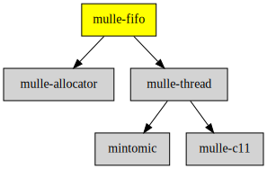

# mulle-fifo

#### 🐍 mulle-fifo fixed sized producer/consumer FIFOs holding `void *`

Written for dual-thread configurations. There is a collection of hardcoded size
FIFOs and there is a FIFO which size can be set at runtime.

You can not store NULL pointers into the FIFOs.

There are FIFOs of sizes 8, 16, 32, 64, 128, 256, 512, 1024, 2048, 4096, 8192.
You can easily create your own custom size.


| Release Version                                       | Release Notes
|-------------------------------------------------------|--------------
|  [](//github.com/mulle-concurrent/mulle-fifo/actions) | [RELEASENOTES](RELEASENOTES.md) |


## Usage

### Fixed

`mulle__pointerfifo64` is  a fixed size 64 pointer FIFO.
Use `_mulle__pointerfifo128` for a 128 pointer FIFO etc.

``` c
void   _mulle__pointerfifo64_init( struct mulle__pointerfifo64 *p)
```

Call this to initalize the FIFO for use.


``` c
void   _mulle__pointerfifo64_done( struct mulle__pointerfifo64 *p)
```

You can call this when no other thread needs the FIFO anymore.


``` c
unsigned int   _mulle__pointerfifo64_get_count( struct mulle__pointerfifo64 *p)
```

Get the number of pointers stored. Thread safe even for multiple threads.


``` c
void   *_mulle__pointerfifo64_read( struct mulle__pointerfifo64 *p)
```

Read from the FIFO. Will return NULL if empty. Will not block.
Only one thread may access the read side.

``` c
int   _mulle__pointerfifo64_write( struct mulle__pointerfifo64 *p,
                                   void *pointer)
```

Write to the FIFO. Will return -1 if full, 0 on success. Will not block.
Only one thread may access the write side.


### Dynamic

The dynamic FIFO is like the static FIFO, except for the `init` and
`done` functions:

```
void   mulle_pointerfifo_init( struct mulle_pointerfifo *p,
                               unsigned int size,
                               struct mulle_allocator *allocator)
```

Call `mulle_pointerfifo_init` to initalize the FIFO for use.
The size is set with the `size` parameter.

Call `mulle_pointerfifo_done` to free the FIFO when no other thread needs it.
This is necessary to avoid leaks. Use `mulle_pointerfifo_read` and
`mulle_pointerfifo_write` for access. The pointerfifo will not block.


### You are here




## Add

**This project is a component of the [mulle-core](//github.com/mulle-core/mulle-core) library. As such you usually will *not* add or install it
individually, unless you specifically do not want to link against
`mulle-core`.**


### Add as an individual component

Use [mulle-sde](//github.com/mulle-sde) to add mulle-fifo to your project:

``` sh
mulle-sde add github:mulle-concurrent/mulle-fifo
```

To only add the sources of mulle-fifo with dependency
sources use [clib](https://github.com/clibs/clib):


``` sh
clib install --out src/mulle-concurrent mulle-concurrent/mulle-fifo
```

Add `-isystem src/mulle-concurrent` to your `CFLAGS` and compile all the sources that were downloaded with your project.


## Install

Use [mulle-sde](//github.com/mulle-sde) to build and install mulle-fifo and all dependencies:

``` sh
mulle-sde install --prefix /usr/local \
   https://github.com/mulle-concurrent/mulle-fifo/archive/latest.tar.gz
```

### Legacy Installation

Install the requirements:

| Requirements                                 | Description
|----------------------------------------------|-----------------------
| [mulle-thread](https://github.com/mulle-concurrent/mulle-thread)             | 🔠 Cross-platform thread/mutex/tss/atomic operations in C
| [mulle-allocator](https://github.com/mulle-c/mulle-allocator)             | 🔄 Flexible C memory allocation scheme

Download the latest [tar](https://github.com/mulle-concurrent/mulle-fifo/archive/refs/tags/latest.tar.gz) or [zip](https://github.com/mulle-concurrent/mulle-fifo/archive/refs/tags/latest.zip) archive and unpack it.

Install **mulle-fifo** into `/usr/local` with [cmake](https://cmake.org):

``` sh
cmake -B build \
      -DCMAKE_INSTALL_PREFIX=/usr/local \
      -DCMAKE_PREFIX_PATH=/usr/local \
      -DCMAKE_BUILD_TYPE=Release &&
cmake --build build --config Release &&
cmake --install build --config Release
```


## Author

[Nat!](https://mulle-kybernetik.com/weblog) for Mulle kybernetiK  


